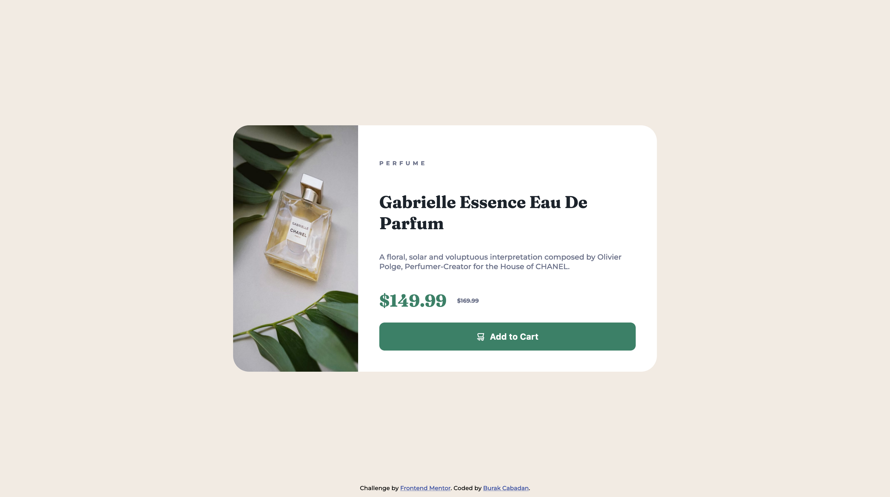

# Frontend Mentor - Product preview card component solution

This is a solution to the [Product preview card component challenge on Frontend Mentor](https://www.frontendmentor.io/challenges/product-preview-card-component-GO7UmttRfa). Frontend Mentor challenges help you improve your coding skills by building realistic projects.

## Table of contents

-   [Overview](#overview)
    -   [The challenge](#the-challenge)
    -   [Screenshots](#screenshots)
    -   [Links](#links)
-   [My process](#my-process)
    -   [Built with](#built-with)
    -   [What I learned](#what-i-learned)
-   [Author](#author)

## Overview

### The challenge

Users should be able to:

-   View the optimal layout depending on their device's screen size
-   See hover and focus states for interactive elements

### Screenshots

### Links

-   Solution URL: [Solution](https://github.com/burakcbdn/frontendmentor-product-preview-card)
-   Live Site URL: [Live Site](https://burakcbdn.me/frontendmentor/challenge/1)

## My process

### Built with

-   Semantic HTML5 markup
-   CSS custom properties
-   Flexbox
-   Mobile-first workflow
-   deployed with NextJS in my portfolio website

### What I learned

I mainly learned to align the divs to the center. This was the hardest challenge of all.

## Author

-   Website - [BurakCabadan](https://www.your-site.com)
-   Frontend Mentor - [@burakcbdn](https://www.frontendmentor.io/profile/burakcbdn)
-   Twitter - [@burakcbdn](https://www.twitter.com/burakcbdn)
